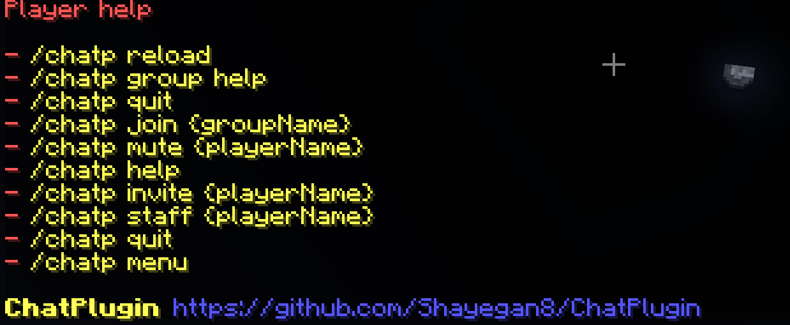
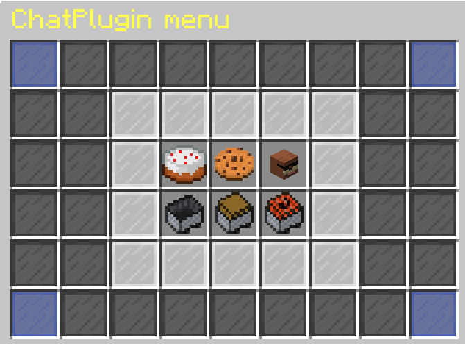

# Description

Chat plugin is a spigot plugin that lets your players to make their own private groups and chat with themselves

## Installation

Install [maven](https://maven.apache.org/install.html) first
```bash
git clone https://github.com/Shayegan8/ChatPlugin.git
cd ChatPlugin
mvn clean install
```

### Dependencies used
- **Sqlite & Postgresql JDBC drivers**
- **PlaceholderAPI**
- **Spigot plugin annotations**
- **lombok**

### Requirements
- ###### Java 21 or higher
- ###### PlaceholderAPI plugin
 
## Images




## License
[MIT](https://choosealicense.com/licenses/mit/)
